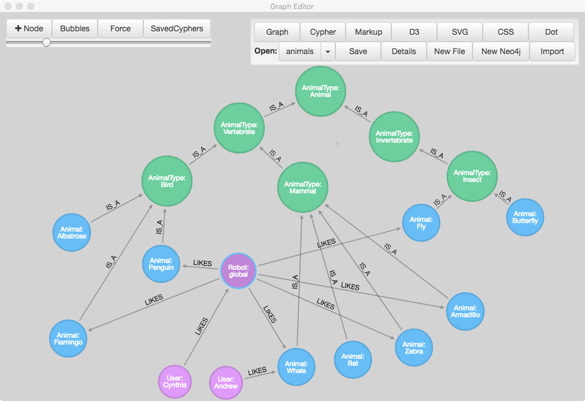

## graph-editor

[https://wwlib.github.io](https://wwlib.github.io/)

[https://wwlib.github.io/graph-editor](https://wwlib.github.io/graph-editor)

(see also: [https://github.com/wwlib/neo4j-knowledge-graph](https://github.com/wwlib/neo4j-knowledge-graph))

### About
graph-editor is an electron-webpack/react app for designing graphs and editing live neo4j databases.

Note: Graph Editor is uses the Graph Diagram library ([https://wwlib.github.io/graph-diagram/](https://wwlib.github.io/graph-diagram/)) which is a TypeScript port of a graph-editing project called Arrows, originally created by Alistair Jones at Neo4j ([http://www.apcjones.com/arrows/](http://www.apcjones.com/arrows/), [https://github.com/apcj/arrows](https://github.com/apcj/arrows)).

### Docs

[https://wwlib.github.io/graph-editor/graph-editor-intro.html](https://wwlib.github.io/graph-editor/graph-editor-intro.html)

### yarn
The use of the [yarn](https://yarnpkg.com/) package manager is **strongly** recommended, as opposed to using `npm`.

```bash
yarn
```

### Development Scripts

```bash
# run application in development mode
yarn dev

# compile source code and create webpack output
yarn compile

# `yarn compile` & create build with electron-builder
yarn dist

# `yarn compile` & create unpacked build with electron-builder
yarn dist:dir
```

### Usage
- Note: This is an early prototype intended for experimentation.
- Use the New File button to create a new local graph File
- Double-click nodes and relationships to edit them



-Use the New Neo4j button to create a connection to a live neo4j database
- set the connection url, user, password, etc.

```
"connection": {
  "type": "neo4j",
  "url": "bolt://localhost:7687",
  "user": "neo4j",
  "password": "<PASSWORD>",
  "initialCypher": "MATCH (n)-[r]-(p) return n,r,p limit 100"
}
```


- Changes in the editor are reflected in the neo4j browser


