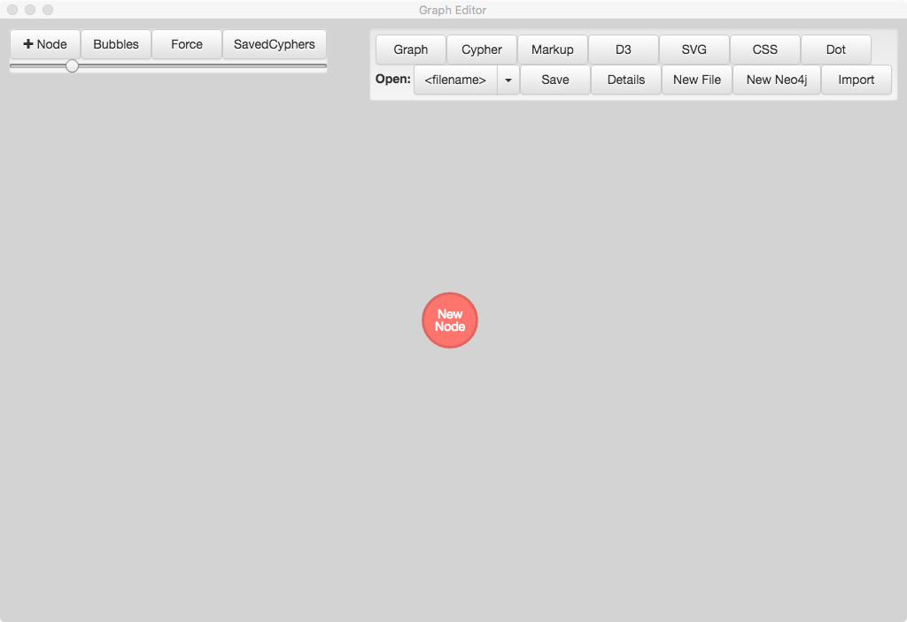
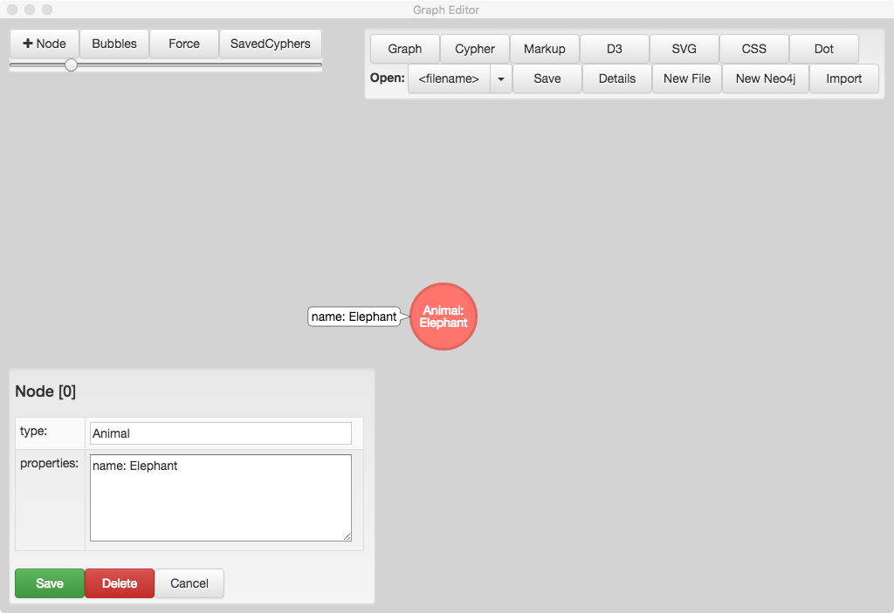
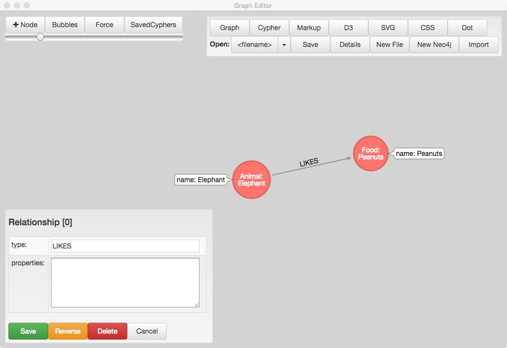
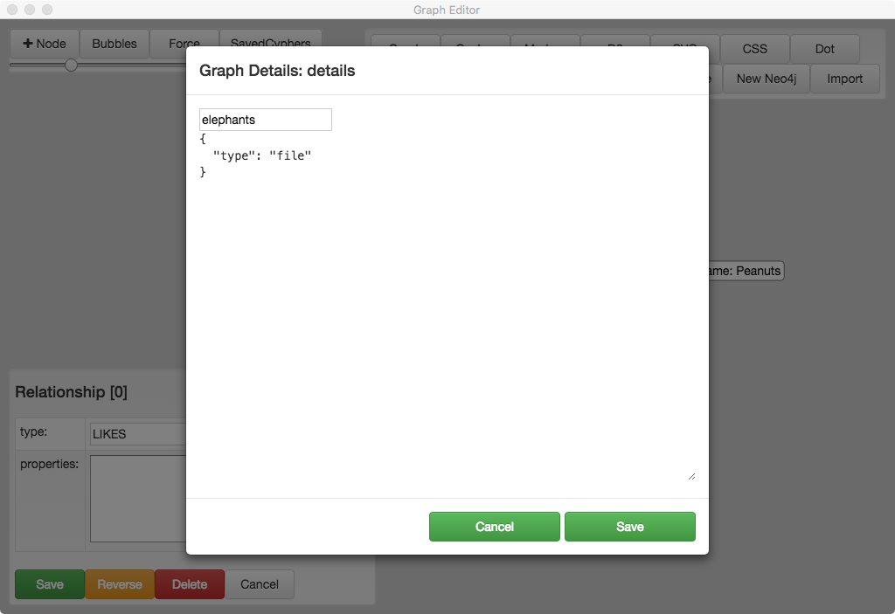
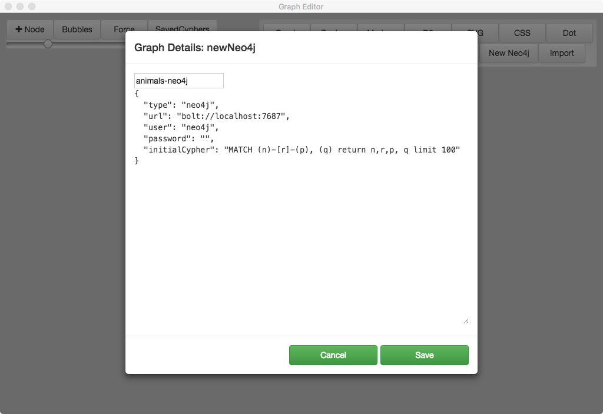
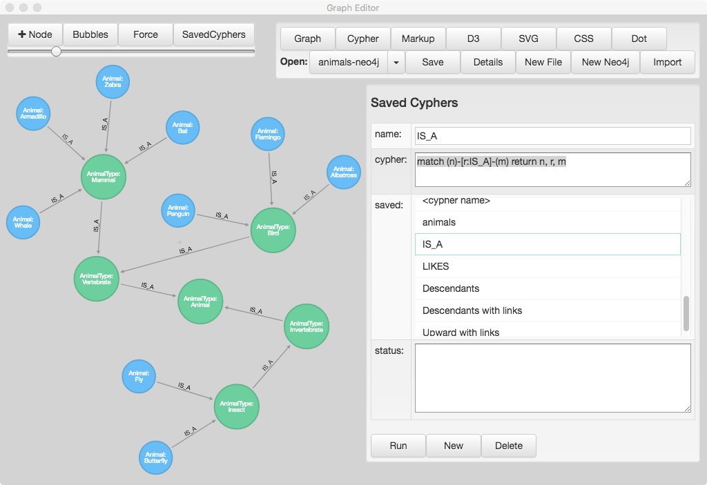
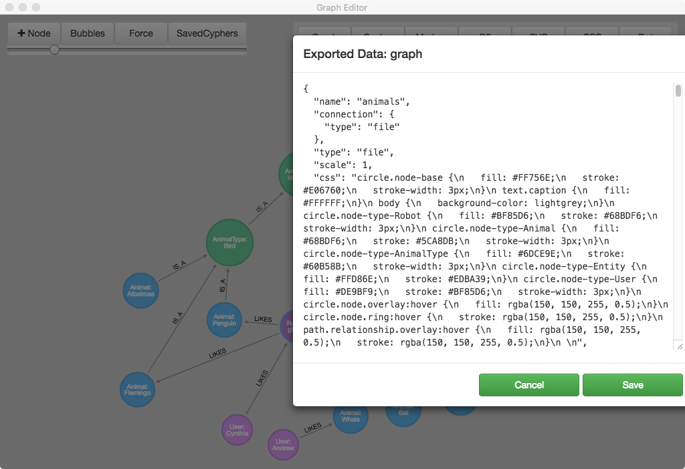
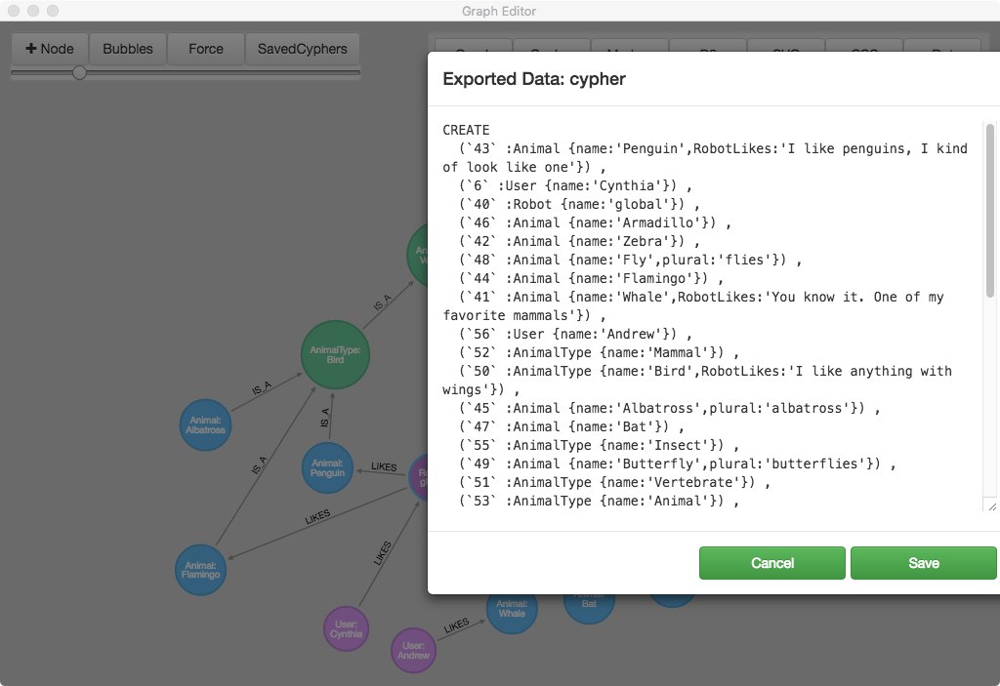

## graph-editor

*Subject*: Graph Editor  
*Language*: TypeScript (node), React, Electron, webpack  
*Repo*: git@github.com:wwlib/graph-editor.git  
*Related*: Neo4j Knowledge Graph Example: [https://wwlib.github.io/neo4j-knowledge-graph/](https://wwlib.github.io/neo4j-knowledge-graph/)

[https://wwlib.github.io/graph-editor/](https://wwlib.github.io/graph-editor/)

[https://github.com/wwlib/graph-editor](https://github.com/wwlib/graph-editor)

[https://wwlib.github.io](https://wwlib.github.io/)

Graph Editor is a tool for viewing and interactively editing Neo4j graphs. It can also be used to create, edit and share simple graph layouts using a json file format.

Note: Graph Editor is uses the Graph Diagram library ([https://wwlib.github.io/graph-diagram/](https://wwlib.github.io/graph-diagram/)) which is a TypeScript port of a graph-editing project called Arrows, originally created by Alistair Jones at Neo4j ([http://www.apcjones.com/arrows/](http://www.apcjones.com/arrows/), [https://github.com/apcj/arrows](https://github.com/apcj/arrows)).

<!--
### Overview

Overview video (YouTube): [https://www.youtube.com/embed/YFRiWiZJPkU](https://www.youtube.com/embed/pEps_xaUWVo)
-->

### Getting Started

#### build

```
git clone git@github.com:wwlib/graph-editor.git
cd graph-editor
yarn
yarn dev
```

#### New Graph

When Graph Editor starts it presents a new empty graph. The most common actions include:
- New node: click the + Node button (top left) or drag a new node by clicking on the perimeter of an existing node and dragging.
- Link two nodes: Click on the perimeter of the source node and drag onto the target node
- Edit a node/link: double-click on the node/link
 - The node/link type will be displayed on the node/link
 - For nodes that have a name property, the name will also be displayed on the node

#### Save a graph
- Click the Save button in the file panel (top right)
 - If prompted, enter a file name in the file details dialog
 - Click the Save button in the file panel (top right)

#### Import a graph json file
- Click on the Import button in the file panel (top right)
 - Navigate to a valid Graph Editor json file
 - Click the Save button in the file panel (top right)

#### Export a graph
- (manual, for now). Click on the Graph button in the file panel (top right)
 - Copy the contents of the Export dialog into a new file (using a text editor)
 - Save the file with a json extension. i.e. my-graph.json

#### Connect to a neo4j graph

- Click the New Neo4j button in the file panel (top right)
 - Give the file (connection) a name
 - Fill out the url, user, and password fields.
 - The initialCypher field is optional and can be blank
 - Click the Save button in the file panel (top right)

#### Local, Static Graphs











#### Connecting to Neo4j



#### Neo4j: Saved Cyphers




#### Import and Export






